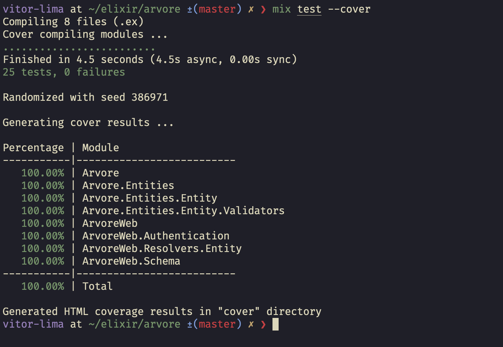
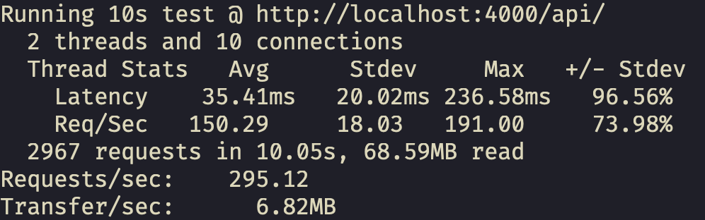

# Arvore

Phoenix API server to manage school networks, schools and classes.

The one and only database model is called `Entity`. It represent school networks, schools and classes based on
the `type` key, and those entities are related through their `parent_id` keys.

* A `network` may have many `schools` as children. It cannot have a parent.
* A `school` may have only one `network` as parent, and many `classes` as children.
* A `class` may have only one `school` as parent and no children.

The `subtree_ids` key must contain the ids of all the entity's children, and their children
recursively. Entities are fetched using a recursive common table expression.

Ex: A network has 100 schools, and each school has 1 to 10 classes. `subtree_ids` must contain the
ids of all related schools and classes.

## Running locally

  * Run `docker-compose up -d` to setup the MySQL database container.
  * Run `mix setup` to install and setup dependencies
  * Start Phoenix endpoint with `mix phx.server` or inside IEx with `iex -S mix phx.server`

Now you can visit [`localhost:4000/api/graphql`](http://localhost:4000/api/graphql) to use the
interactive GraphQL interface.

## API

A GraphQL api is exposed at `/api` with the following queries:

### Create Entity

```graphql
mutation CreateEntity(
  $name: String!,
  $entityType: String!,
  $inep: String,
  $parentId: Int,
) {
createEntity(
  name: $name,
  entityType: $entityType, 
  inep: $inep,
  parent_id: $parentId
) {
  id
  name
  entityType
  inep
  parentId
  subtreeIds
}
```

### Update Entity

```graphql
mutation UpdateEntity(
  $id: Int!,
  $name: String,
  $entityType: String,
  $inep: String,
  $parentId: Int,
) {
updateEntity(
  id: $id,
  name: $name,
  entityType: $entityType, 
  inep: $inep,
  parent_id: $parentId
) {
  id
  name
  entityType
  inep
  parentId
  subtreeIds
}
```

### Get Entity

```graphql
query GetEntity($id: Int!) {
  getEntity(id: $id) {
    id
    name
    entityType
    inep
    parentId
    subtreeIds
  }
}
```

## E2E Tests

Domain and GraphQL API modules are fully tested on `test/e2e/entities_test.ex`.



## Load Tests

Simple `wrk` load test lua scripts are at `test/load_tests`.
* Install wrk
* Start the server locally
* Run: `wrk http://localhost:4000/api/ -s test/load_tests/<load_test_file>.lua`

### Create Entity load test

Low complexity validation + I/O operation.


### Fetch Entity load test

High complexity recursive fetch on 2000+ nested entities.

If you created any enitities before running the seeder, drop the local database and run the seeder
before running this test. This will query for a network with thousands of entities in it's subtree.



